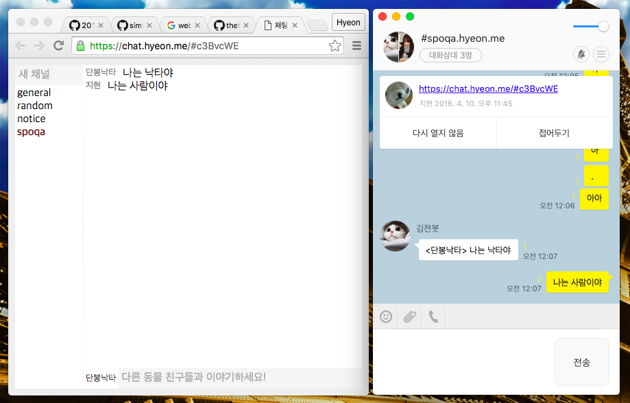

Chat [![Build Status]][Travis CI]
========
Simple web-based chat app.


```bash
# Building client-side codes
cd client

npm install   # Install dependencies
npm run build # Build

npm start     # Run webpack in watch mode
```
```bash
# Running server
cd server
bundle        # Install dependencies

./run         # Start a server
              # See http://localhost:4567


# Start the server in production mode
RACK_ENV=production ./run
```

--------

MIT License

[Build Status]: https://travis-ci.org/simnalamburt/chat.svg?branch=master
[Travis CI]: https://travis-ci.org/simnalamburt/chat
